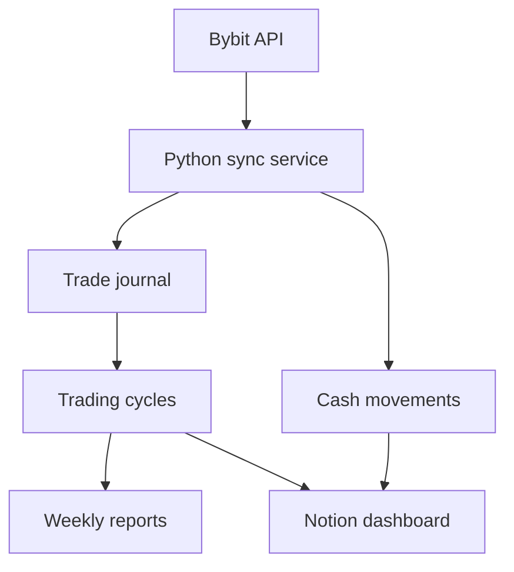

# Bybit → Notion Trading Automator

A Python automation project that synchronizes executed Bybit spot orders with a structured Notion trading workspace. It tracks grid entries, partial exits, fees, realized P&L, completed trading cycles, weekly reports, cash movements, and a financial dashboard.

> Portfolio project built around a real trading-accounting workflow. It does **not** place orders and is not financial advice.

## What it automates

- Imports executed spot orders from Bybit.
- Prevents duplicate imports using Bybit execution IDs and local state.
- Groups multiple buys and partial sells into one trading cycle.
- Calculates weighted cost basis and realized net profit.
- Handles fees paid in either the base asset or USDT.
- Closes a cycle only after the position is fully sold.
- Creates a completed-cycle summary in Notion.
- Links all journal operations to their cycle.
- Creates or updates the corresponding weekly report.
- Imports confirmed USDT deposits and withdrawals without duplicating history.
- Treats Funding → Unified transfers as owner contributions and Unified → Funding transfers as withdrawals, including P2P-funded capital.
- Updates dashboard values for contributions, realized profit, balance, and ROI.
- Runs unattended with Windows Task Scheduler.

## Architecture



## Safety design

- The Bybit key should be **read-only**, with Unified Trading Account and Assets access enabled.
- The service never creates, changes, or cancels orders.
- `.env` and `state.json` are excluded from Git.
- Historical trades and cash movements are checkpointed on first launch unless explicit history import is enabled.
- Notion writes use unique execution IDs to avoid duplicate journal entries.

## Tech stack

- Python 3.11+
- [pybit](https://github.com/bybit-exchange/pybit)
- Bybit V5 API
- Notion API
- Windows Task Scheduler
- `unittest`

## Setup

1. Clone the repository and create a virtual environment.

```powershell
python -m venv .venv
Set-ExecutionPolicy -Scope Process -ExecutionPolicy Bypass
.\.venv\Scripts\Activate.ps1
pip install -r requirements.txt
```

2. Copy `.env.example` to `.env` and fill in your own IDs and credentials.

```powershell
Copy-Item .env.example .env
```

3. Give the Notion integration access to the journal, cash-flow, cycle, weekly-report, and dashboard pages.

4. Start in preview mode:

```env
DRY_RUN=true
DASHBOARD_ENABLED=false
```

```powershell
python sync.py
```

5. After validating the preview, enable writes in `.env`:

```env
DRY_RUN=false
DASHBOARD_ENABLED=true
```

## Required Notion structure

The automation expects four related databases:

1. **Trade journal** — executions, price, quantity, fees, profit, cycle number, and Bybit IDs.
2. **Trading cycles** — entry/exit totals, average prices, fees, ROI, and linked executions.
3. **Weekly reports** — linked cycles, weekly profit, cycle count, and cumulative profit.
4. **Cash movements** — confirmed deposits, withdrawals, and balance impact.

Property names in `sync.py` are Ukrainian because the original production workspace was built in Ukrainian. They can be renamed in the code to match another workspace.

## Tests

```powershell
python -m unittest -v
```

The included tests cover execution normalization, a complete weighted-average buy/sell cycle with fees, and Funding ↔ Unified cash-flow classification.

## Windows Task Scheduler

Example manual command:

```powershell
C:\path\to\project\.venv\Scripts\python.exe C:\path\to\project\sync.py
```

Schedule it at a suitable interval, such as every five minutes. The computer must be running and connected to the internet.

## Portfolio summary

This project demonstrates API integration, financial workflow modeling, idempotent synchronization, state management, data transformation, relational Notion design, automated reporting, and scheduled background execution.
